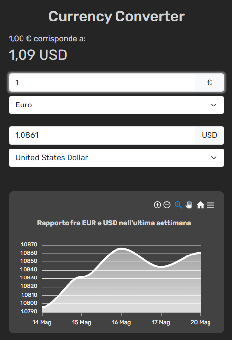

# Currency Converter

Currency Converter è una pagina web, compatibile sia con dispositivi mobili che desktop, che permette di convertire una valuta in un'altra. Questo progetto è stato realizzato per facilitare le conversioni di valute in modo rapido ed efficiente.


<div style="border-radius: 20px; overflow: hidden; max-width: 400px;">
  
</div>

- [Caratteristiche](#caratteristiche)
- [Tecnologie Utilizzate](#tecnologie-utilizzate)
- [Installazione](#installazione)
- [Utilizzo](#utilizzo)
- [Licenza](#licenza)
- [Contatti](#contatti)

## Caratteristiche

- **Conversione Valuta**: Converti istantaneamente tra diverse valute.
- **Interfaccia Responsive**: Utilizzabile sia su dispositivi mobili che desktop.
- **Aggiornamento Tassi di Cambio**: Tassi di cambio aggiornati in tempo reale.
- **Grafico Storico**: Visualizza l'andamento del tasso di cambio nell'ultima settimana/mese (a seconda della visualizzazione mobile/desktop).
- **Design Intuitivo**: Interfaccia utente semplice e pulita per un'esperienza d'uso ottimale.

## Utilizzo

1. Inserisci l'importo da convertire nel primo campo di input.
2. Seleziona la valuta di origine dal primo menu a tendina.
3. Seleziona la valuta di destinazione dal secondo menu a tendina.
4. Visualizza il risultato della conversione nel secondo campo di input
5. In alternativa, tutta l'operazione viene sintetizzata nella sezione subito sotto il titolo, con l'importo e la valuta formattati.
6. Le operazioni viste sopra possono anche procedere nel verso opposto, inserendo l'importo da convertire nel *secondo* campo di input.
7. Il grafico sotto i campi di input mostra l'andamento del tasso di cambio tra le due valute nell'ultima settimana/mese in base alla visualizzazione mobile o desktop.

## Tecnologie Utilizzate

- **Linguaggi**: HTML, CSS, JavaScript
- **Framework**: Bootstrap, Vue.js
- **API**: [API Frankfurter](https://www.frankfurter.app/docs/) per i tassi di cambio
- **Strumenti di Build**: Webpack
- **Grafici**: [Apex Charts](https://apexcharts.com/)

## Installazione

Per eseguire localmente il progetto, segui questi passaggi:

1. Clona il repository:
    ```bash
    git clone https://github.com/aldoaquino451/vue-currency-converter.git
    ```

2. Naviga nella directory del progetto:
    ```bash
    cd vue-currency-converter
    ```

3. Installa le dipendenze:
    ```bash
    npm install
    ```

4. Avvia il server di sviluppo:
    ```bash
    npm run dev
    ```

5. Apri il tuo browser e vai a `http://localhost:5173/vue-currency-converter/` per vedere l'applicazione in esecuzione.


## Licenza

Questo progetto è distribuito sotto la licenza MIT. Vedi il file [LICENSE](LICENSE) per maggiori dettagli.

## Contatti

Per qualsiasi domanda o feedback, puoi contattarmi all'indirizzo email [aldo.aquino2909@gmail.com](mailto:aldo.aquino2909@gmail.com) o attraverso il mio profilo [Linkedin](https://www.linkedin.com/in/aldo-aquino-dev/) 


